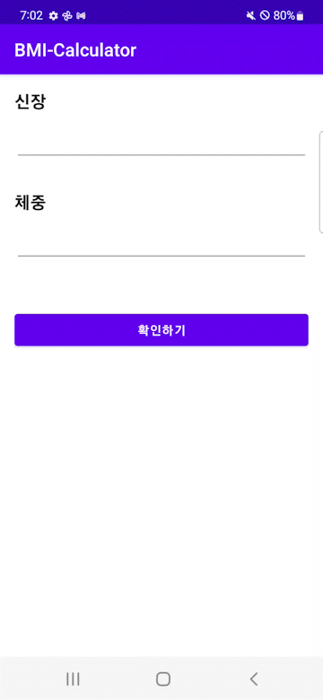

# BMI 계산기
---
> 사용자의 키와 몸무게 정보를 입력 받아 BMI 값을 계산하여 보여준다.

<br>

### 기능
---
| example | MainActivity | ResultActivity |
|------|----|---|
 |  | 

<br>

### 구현
---
#### Intent
**다른 액티비티로 값을 전달하는 과정**
1. Activity A에서  startActivity()로 Intent를 Android System으로 전달
2. AndroidMenifest가 정의된 activity를 찾은 다음에 해당 activity를 실행
3. onCreate()를 실행하는데, 실행할 때 Intent를 같이 넣어서 실행
4. Activity B에 최종적으로 전달됨
```kotlin
// MainActivity.kt
resultButton.setOnClickListener {

    ...

    val intent = Intent(this, ResultActivity::class.java)
    intent.putExtra("height", height)
    intent.putExtra("weight", weight)
    startActivity(intent)
}
```
```kotlin
// ResultActivity.kt
override fun onCreate(savedInstanceState: Bundle?) {
    ...

    val height = intent.getIntExtra("height", 0)
    val weight = intent.getIntExtra("weight", 0)
    ...
}
```
#### 예외처리
- 값을 입력하지 않았을 때 Toast 메세지를 보여주고 화면을 이동하지 않는다.
  ```kotlin
  resultButton.setOnClickListener {

        // 빈 값이 있을 경우 숫자로 변환하지 못해 예외처리가 필요
        if (heightEditText.text.isEmpty() || weightEditText.text.isEmpty()) {
            Toast.makeText(this, "빈 값이 있습니다.", Toast.LENGTH_SHORT).show()
            return@setOnClickListener // 중첩된 함수에서 return 할 함수를 명시해줌.
        }
        ...
    }
    ```
