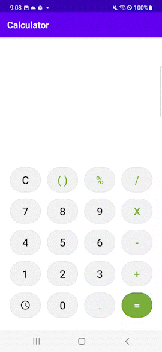
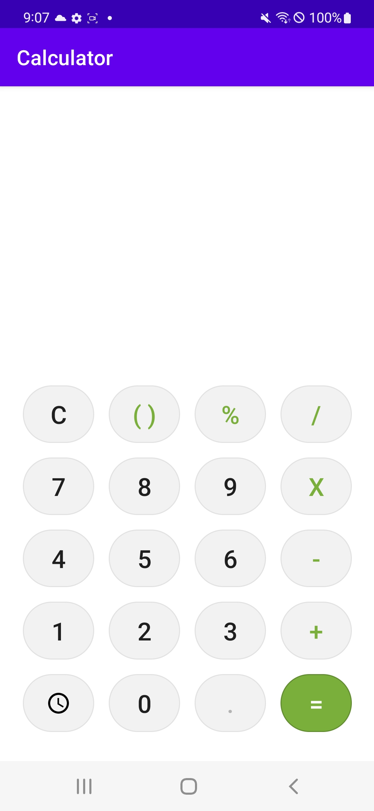
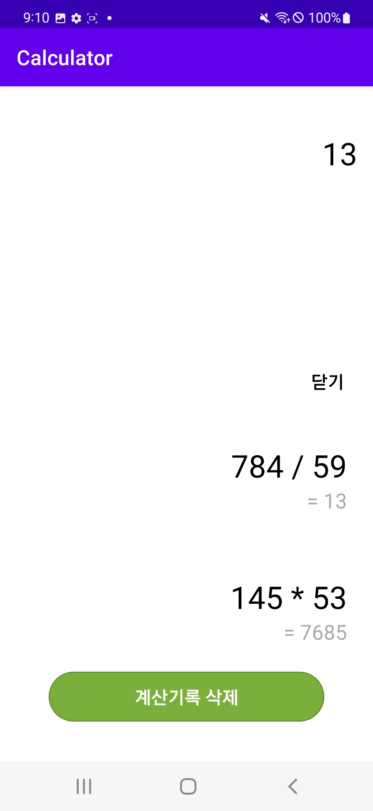
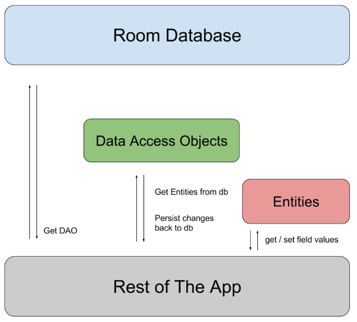

# 계산기
---
> 사용자가 요청한 수식을 계산하고 결과를 기기에 저장합니다.

<br>

### 기능
---
|&nbsp;&nbsp;&nbsp;&nbsp;&nbsp;&nbsp;&nbsp;&nbsp;Example&nbsp;&nbsp;&nbsp;&nbsp;&nbsp;&nbsp;&nbsp;&nbsp;|MainActivity|&nbsp;&nbsp;&nbsp;&nbsp;&nbsp;history&nbsp;&nbsp;&nbsp;&nbsp;|
|---|---|---|
 | |

<br>

### 구현
---
#### TableLayout
각 버튼을 일정한 간격으로 배치하기 위해 TableLayout 활용
- shrinkColumns
  - TableLayout의 내용을 전체 너비를 넘어갈 경우, 선택한 열의 너비를 줄입니다.
  - ','를 통한 복수열 선택을 불가능하며, '*'를 통해 모든 열을 줄일 수 있습니다.
```xml
<TableLayout
    android:id="@+id/keypadTableLayout"
    android:layout_width="0dp"
    android:layout_height="0dp"
    android:paddingHorizontal="15dp"
    android:paddingVertical="21dp"
    android:shrinkColumns="*"
    app:layout_constraintBottom_toBottomOf="parent"
    app:layout_constraintEnd_toEndOf="parent"
    app:layout_constraintStart_toStartOf="parent"
    app:layout_constraintTop_toBottomOf="@id/topLayout"
    app:layout_constraintVertical_weight="1.5">

    <TableRow android:layout_weight="1">
        <!-- 각 아이템 배치 -->
    </TableRow>
    ...
</TableLayout>
```
#### LayoutInflater
기존에 레이아웃을 액티비티에 연결하기 위해서 setContentView 함수를 사용했었지만, 하나의 통 레이아웃 말고 **view를 작게 분할하여 사용**할 때 씁니다.
```kotlin
val historyView = LayoutInflater.from(this).inflate(R.layout.history_row, null, false)
historyView.findViewById<TextView>(R.id.expressionTextView).text = it.expression
historyView.findViewById<TextView>(R.id.resultTextView).text = "= ${it.result}"
```


#### Room & Thread
계산결과를 로컬에 저장하고 사용자 요청 시 로드하여 보여줍니다.

1. Entity 생성
   - data class로 테이블을 정의하고, 해당 클래스 위에 `@Entity` 어노테이션을 붙입니다.
   - 테이블 안에 속성을 정의했습니다.
   ```kotlin
   @Entity
    data class History(
        @PrimaryKey val uid: Int?,
        @ColumnInfo(name = "expression") val expression: String?,
        @ColumnInfo(name = "result") val result: String?
    )
    ```
2. dao 생성
    - interface로 정의한 후, `@Dao` 어노테이션을 붙입니다.
    - 요청 함수를 정의한 후, 해당 함수의 기능을 쿼리로 작성했습니다.
    ```kotlin
    @Dao
    interface HistoryDao {

        @Query("SELECT * FROM history")
        fun getAll(): List<History>

        @Insert
        fun insertHistory(history: History)

        @Query("DELETE FROM history")
        fun deleteAll()

    }
    ```
3. Database 생성
데이터베이스는 앱에 저장되어 있는 로컬 데이터에 대한 액세스 포인트를 제공해주는 역할을 합니다.
    - Roomdatabase를 상속받는 추상 클래스로 정의했습니다. android 공식 개발문서에서 Room 지속성 라이브러리를 추상화 레이어로 사용하는 것이 SQLite 데이터베이스에 있는 정보에 액세스 할 때 좋다고 소개하고 있습니다.
    - 위에서 정의한 HistoryDao를 리턴하는 함수를 정의한다.
    ```kotlin
    @Database(entities = [History::class], version = 1)
        abstract class AppDatabase : RoomDatabase() {
            abstract fun historyDao(): HistoryDao
    }
    ```
4. activity 데이터베이스 사용 : DB에 접근할 때는 main thread와 별개로 다른 **Thread**를 만들어서 실행시킵니다.
    - 초기화 및 빌드
    ```kotlin
    class MainActivity : AppCompatActivity() {
        ...
        lateinit var db: AppDatabase
        ...
        override fun onCreate(savedInstanceState: Bundle?) {
            ...
            db = Room.databaseBuilder(
                applicationContext,
                AppDatabase::class.java,
                "historyDB"
            ).build()
        }
    ```
    - 계산결과를 DB에 저장
    ```kotlin
    fun resultButtonClicked(v: View) {
        ...
        Thread(Runnable {
            db.historyDao().insertHistory(History(null, expressionText, resultText))
        }).start()
        ...
    }
    ```
    - 저장된 데이터들 불러와서 View에 표시하기 : UI 관련 로직은 runOnUiThread 블럭 안에서 실행되도록 했습니다.
    ```kotlin
    Thread(Runnable {
        db.historyDao().getAll().reversed().forEach {
            runOnUiThread {
                val historyView = LayoutInflater.from(this).inflate(R.layout.history_row, null, false)
                historyView.findViewById<TextView>(R.id.expressionTextView).text = it.expression
                historyView.findViewById<TextView>(R.id.resultTextView).text = "= ${it.result}"

                historyLinearLayout.addView(historyView)
            }
        }
    }).start()
    ```
    - DB에 저장된 데이터 삭제
    ```kotlin
    historyLinearLayout.removeAllViews()
    Thread(Runnable {
        db.historyDao().deleteAll()
    }).start()
    ```
#### 확장함수
계산식의 첫번째 인자와 마지막 인자가 Number가 아닌 경우, 예외처리를 해주었습니다.
Kotlin의 String 기본 클래스에서는 숫자를 판별하는 메서드를 제공해주고 있지 않기 때문에 확장함수 기능으로 정의하여 사용했습니다.
```kotlin
fun String.isNumber(): Boolean {
    return try {
        this.toBigInteger()
        true
    } catch (e: RuntimeException) {
        false
    }
}
// 사용 예시
if (expressionTexts[0].isNumber().not() || expressionTexts[2].isNumber().not()) {
    Toast.makeText(this, "오류가 발생했습니다.", Toast.LENGTH_SHORT).show()
    return
}
```
#### [SpannableStringBuilder](https://developer.android.com/guide/topics/text/spans?hl=ko)
숫자와 연산자의 색깔을 구분하여 계산식 TextView에 표시하기 위해 SpannableStringBuilder를 사용했습니다.
1. SpannableStringBuilder 초기화
   ```kotlin
   val ssb = SpannableStringBuilder(expressionTextView.text)
   ```
2. setSpan으로 스타일 변경
   ```kotlin
   ssb.setSpan(
        ForegroundColorSpan(getColor(R.color.green)), //변경할 스타일
        expressionTextView.text.length - 1, //시작 범위
        expressionTextView.text.length, //끝 범위
        Spannable.SPAN_EXCLUSIVE_EXCLUSIVE //span 경계에 삽입된 텍스트를 변경에 반영하지 않도록 합니다.
    )
    expressionTextView.text = ssb
    ```
#### 예외처리
- 계산식의 길이가 15보다 클 경우, 더이상 숫자 입력 받지 않음
    
    ```kotlin
    if (expressionText.isNotEmpty() && expressionText.last().length >= 15) {
        Toast.makeText(this, "15자리까지만 사용할 수 있습니다.", Toast.LENGTH_SHORT).show()
        return
    }
    ```
    
- 계산식의 첫 입력 숫자로 0을 입력할 경우, 입력 받지 않음
    
    ```kotlin
    if (expressionText.last().isEmpty() && number == "0") {
        Toast.makeText(this, "0은 제일 먼저 올 수 없습니다.", Toast.LENGTH_SHORT).show()
        return
    }
    ```
    
- 연산자를 두개 연속 입력했을 때: 앞서 입력한 연산자를 삭제하고 뒤에 입력한 연산자를 입력한다
    - dropLast 함수 사용
- 한 줄에 계산식에는 하나의 연산자만 사용할 수 있다.
- 아직 연산자를 입력하지 않았거나 숫자+연산자+숫자 조합이 아닌 경우 계산하지 않음
    
    ```kotlin
    if (hasOperator.not() || expressionTexts.size != 3) {
        return ""
    }
    ```
    
- 계산식의 첫 인자가 숫자가 아닌 경우, 계산하지 않는다.
    - 확장함수 기능을 이용해서 String에 isNumber 함수를 만든다
    - 클래스 밖에 선언하며, “객체".”함수명" 형태이다.
    
    ```kotlin
    fun String.isNumber(): Boolean {
        return try {
            this.toBigInteger()
            true
        } catch (e: RuntimeException) {
            false
        }
    }
    ```
    
- 계산 결과 출력에서 계산식의 텍스트가 비어있거나 숫자만 입력됐을 경우 처리하지 않음
- 숫자와 연산자만 입력됐을 경우