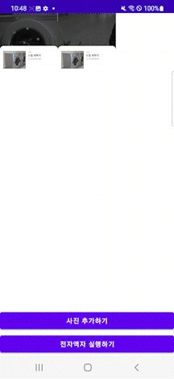

# 전자액자
---
> 로컬에 저장된 사진을 불러 온 뒤, 해당 사진들을 자동연속재생으로 보여줍니다.

 

### 기능
---
| Main | &nbsp;&nbsp;&nbsp;&nbsp;&nbsp;&nbsp;&nbsp;사진&nbsp;추가&nbsp;&nbsp;&nbsp;&nbsp;&nbsp;&nbsp;| &nbsp;&nbsp;&nbsp;전자액자&nbsp;실행&nbsp;&nbsp;&nbsp; |
|------|----|---|
 |  | 

 

### 구현
---

- 사진 저장소 접근 권한 요청

  - ContextCompat의 checkSelfPermission 메서드를 활용해서 권환 확인
  - PackageManager로 반환됨
    - PERMISSION_GRANTED : 접근 가능
    - PERMISSION_DENIED : 접근 제한

- 범위지정함수를 사용하여 ImageViewList 초기화
